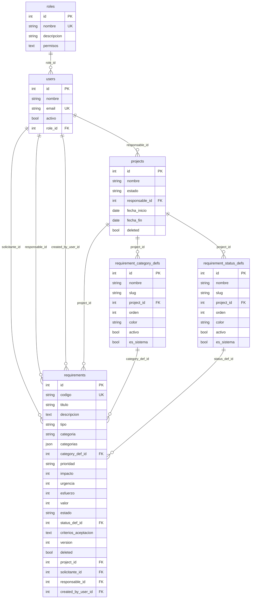
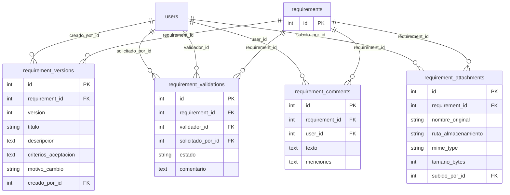
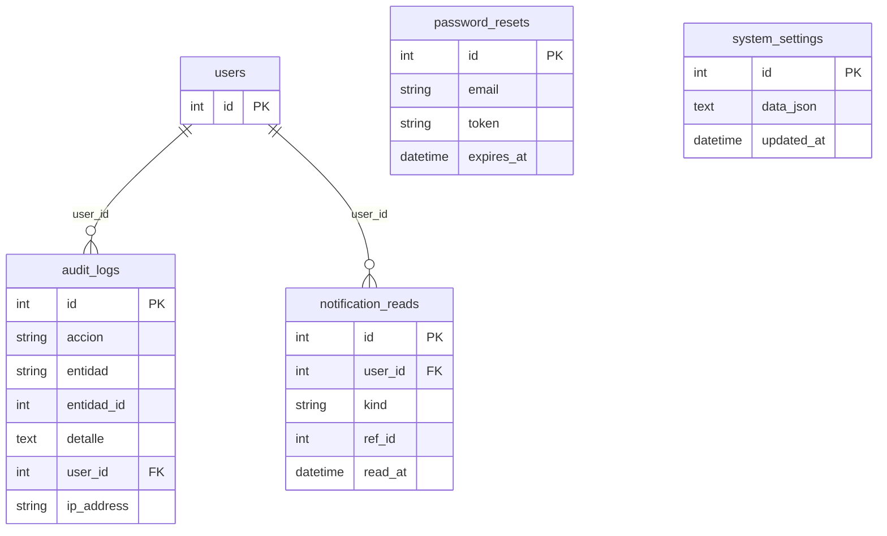

# Diagramas de base de datos — HealthPlus

Fuente: entidades TypeORM en `backend/src/**/*.entity.ts`. Motor objetivo: **MSSQL** (tipos equivalentes en el diagrama lógico).

## Cómo visualizar

| Formato     | Uso                                                                                                                                          |
| ----------- | -------------------------------------------------------------------------------------------------------------------------------------------- |
| **DBML**    | Abre [dbdiagram.io](https://dbdiagram.io), *Import* → pega o sube `[database.dbml](./database.dbml)`. Exporta a PNG/PDF/SQL desde el editor. |
| **Mermaid** | Vista previa en GitHub, VS Code (extensión Mermaid), o [mermaid.live](https://mermaid.live).                                                 |

---

## 1. Vista general (dominio principal)

---

## 2. Requisito: versiones, validaciones, comentarios y adjuntos

---

## 3. Auditoría, autenticación, configuración y notificaciones

---

## Tablas (resumen)

| Tabla                       | Descripción breve                                                                 |
| --------------------------- | ----------------------------------------------------------------------------------- |
| `roles`                     | Catálogo de roles; incluye `permisos` (JSON) para matriz UI/cliente.               |
| `users`                     | Usuarios; FK a `roles`.                                                            |
| `projects`                  | Proyectos; responsable opcional (`users`).                                         |
| `requirement_category_defs` | Categorías de requisito (por proyecto o globales); único `(slug, project_id)`.     |
| `requirement_status_defs`   | Estados configurables; único `(slug, project_id)`.                                 |
| `requirements`              | Requisitos; núcleo del dominio. Incluye `created_by_user_id` (creador) y `categorias` (JSON, slugs múltiples). |
| `requirement_versions`      | Historial de versiones de contenido.                                                 |
| `requirement_validations`   | Validaciones por validador; opcional `solicitado_por_id` (quien pidió la validación). |
| `requirement_comments`      | Comentarios; columna `menciones` (JSON array de IDs de usuarios).                  |
| `requirement_attachments`   | Metadatos de archivos subidos.                                                     |
| `audit_logs`                | Trazabilidad de acciones.                                                          |
| `password_resets`           | Tokens de recuperación de contraseña.                                              |
| `system_settings`           | Configuración global (`data` JSON); clave primaria fija (no identity), típ. `id=1`. |
| `notification_reads`        | Marca de lectura por usuario (`kind` + `ref_id`); único `(user_id, kind, ref_id)`. |

---

## Mantenimiento

Tras añadir o cambiar entidades TypeORM, actualiza `database.dbml` y los bloques Mermaid de este archivo para que sigan alineados con el código.
